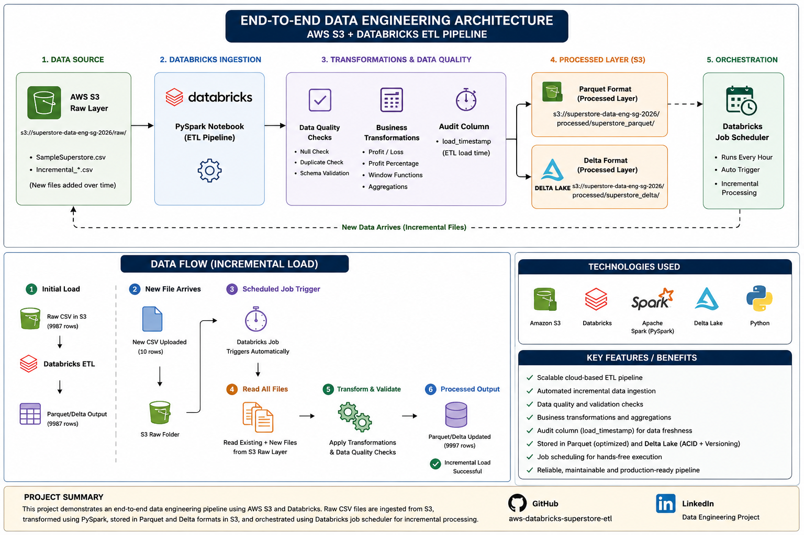
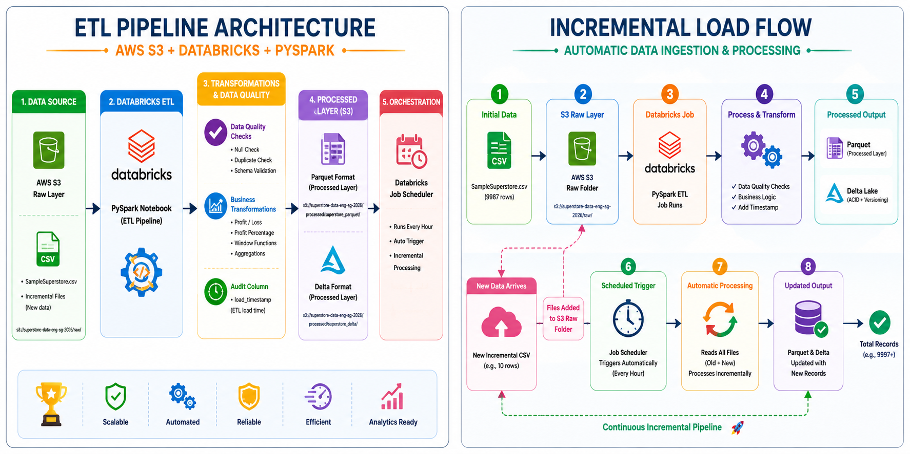

# AWS S3 + Databricks ETL Pipeline with Incremental Loading

## Project Overview

This project demonstrates an end-to-end Data Engineering pipeline built using **AWS S3**, **Databricks**, and **PySpark**.

The pipeline ingests raw CSV files from Amazon S3, performs data quality checks and business transformations using PySpark, stores the processed data in Parquet and Delta formats, and automates execution using Databricks Job Scheduling.

---

## Architecture



---

## Incremental Load Flow



---

## Technologies Used

* AWS S3
* Databricks Free Edition
* PySpark
* Delta Lake
* Parquet
* Databricks Jobs & Scheduling
* GitHub

---

## Dataset

Dataset Used:

**Sample Superstore Dataset**

Contains sales transactions across multiple regions and categories.

Columns:

* Ship Mode
* Segment
* Country
* City
* State
* Postal Code
* Region
* Category
* Sub-Category
* Sales
* Quantity
* Discount
* Profit

---

## Project Flow

### 1. Raw Data Storage

CSV files are uploaded to:

```text
s3://superstore-data-eng-sg-2026/raw/
```

---

### 2. Data Ingestion

PySpark reads all files from the raw layer.

```python
df = spark.read.csv(
    "s3://superstore-data-eng-sg-2026/raw/",
    header=True,
    inferSchema=True
)
```

---

### 3. Data Quality Checks

Performed:

* Null Value Analysis
* Duplicate Detection
* Schema Validation
* Record Count Verification

Example:

```python
from pyspark.sql.functions import *

df.select([
    count(when(col(c).isNull(), c)).alias(c)
    for c in df.columns
])
```

---

### 4. Business Transformations

Added:

### Profit Status

```python
df = df.withColumn(
    "Profit_or_loss",
    when(col("Profit") >= 0, "Profit")
    .otherwise("Loss")
)
```

### Profit Percentage

```python
df = df.withColumn(
    "Profit_Percentage",
    round((col("Profit") / col("Sales")) * 100, 2)
)
```

### Load Timestamp

```python
from pyspark.sql.functions import current_timestamp

df = df.withColumn(
    "load_timestamp",
    current_timestamp()
)
```

---

### 5. Analytics Using Window Functions

Example:

Top Category by Sales in Each State

```python
from pyspark.sql.window import Window
from pyspark.sql.functions import *

state_sales = (
    df.groupBy("State","Category")
      .agg(round(sum("Sales"),2).alias("Total_Sales"))
)

window_spec = Window.partitionBy("State") \
                    .orderBy(col("Total_Sales").desc())

result = (
    state_sales
    .withColumn("Rank",dense_rank().over(window_spec))
    .filter(col("Rank")==1)
)
```

---

### 6. Processed Layer (Parquet)

```python
df.write.mode("overwrite").parquet(
    "s3://superstore-data-eng-sg-2026/processed/superstore_parquet/"
)
```

Benefits:

* Columnar Storage
* Faster Reads
* Better Compression
* Analytics Optimized

---

### 7. Delta Lake Layer

```python
df_delta.write \
    .format("delta") \
    .mode("overwrite") \
    .save(
        "s3://superstore-data-eng-sg-2026/processed/superstore_delta/"
    )
```

Benefits:

* ACID Transactions
* Time Travel
* Data Versioning
* MERGE / UPDATE / DELETE Support

---

### 8. Incremental Loading Test

Initial Record Count:

```text
9987
```

Uploaded additional file containing:

```text
10 New Records
```

After Scheduled Execution:

```text
9997
```

Result:

Incremental ingestion successfully validated.

---

### 9. Job Scheduling

Databricks Job Scheduler configured to:

* Execute every hour
* Read new files from S3 Raw Layer
* Apply transformations automatically
* Refresh Processed Layer

---

## Key Learnings

* AWS S3 Integration with Databricks
* PySpark Data Processing
* Data Quality Validation
* Window Functions
* Incremental Data Loading
* Parquet Optimization
* Delta Lake Fundamentals
* ETL Automation
* Job Scheduling

---

## Future Enhancements

* Delta MERGE Operations
* Medallion Architecture (Bronze/Silver/Gold)
* Databricks SQL Dashboard
* AWS Glue Integration
* CI/CD Deployment Pipeline

---

## Author
Shubham Guha
